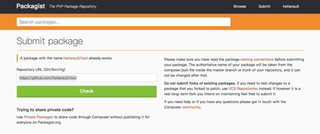

## 示例
```
<?php

use Tinson\Tool\AddressSeparator.php

//分离地址姓名、电话、邮编和省市区详细地址
$str = "张三,13001277920  335500  大理胡人街道八大胡同42号";
$arr = AddressSeparator::getInstance()->handle($str);
var_dump($arr);

//省市区详细地址
$address = "云南大理胡人街道八大胡同42号";
$arr = AddressSeparator::getInstance()->handleAddress($address);
var_dump($arr);

```

## composer创建包

1.在github上创建一个项目

2.编写composer.json

参考本项目示例

3.copy代码文件并修改命名空间

参考本项目示例

4.在https://packagist.org/packages/submit上递交自己的包


```
在上图，在输入框里面填入Git URL，然后点击check就可以上传自己的包了。

https://github.com/hetiansu5/tool.git

这里需要特别说明一下，最好多打几个release的tag，这样packagist才会认定你的包是稳定的，否则会不成功。
```


5.设置github的hook

```
第5步设置hook，主要作用是Github项目有更新时，会通知packagist更新。

如何配置packagist更新文档地址：https://packagist.org/about#how-to-update-packages。

如果懒的话，也可以直接在packagist控制后台手动更新。
```

6.composer.json使用示例

```
{
    "name": "test",
    "description": "测试",
    "type": "project",
    "require": {
        "tinson/tool": "~1.0"
    }
}
```

```
composer update -o --no-plugins --no-scripts
```

7.PHP使用示例
```
<?php

use Tinson\Tool\Validate;

date_default_timezone_set('Asia/Chongqing');
$rootPath = __DIR__;
require $rootPath . '/vendor/autoload.php';
$res = Validate::isEmail("541919050@qq.com");
var_dump($res);
```


